# STAC CMS Quick Start

Get started in 5 minutes! 🚀

## What You'll Build


## Setup Flow

```mermaid
flowchart TD
    A[Use Template] --> B[Enable GitHub Pages]
    B --> C[Access CMS]
    C --> D[Create Content]
    D --> E[Auto-Validate ✅]
    E --> F[Published!]

    style A fill:#4CAF50,color:#fff
    style B fill:#2196F3,color:#fff
    style C fill:#FF9800,color:#fff
    style D fill:#9C27B0,color:#fff
    style E fill:#4CAF50,color:#fff
    style F fill:#00BCD4,color:#fff
```



## 3 Steps to Start

### 1. Create Repository

```bash
gh repo create my-stac-catalog \
  --template walkthru-earth/stac-cms-template \
  --public --clone
```

Or click **"Use this template"** on GitHub.

### 2. Enable GitHub Pages

```yaml
Settings → Pages
  Source: main branch
  Folder: / (root)
  Save ✅
```

### 3. Open CMS

```
https://YOUR-USERNAME.github.io/YOUR-REPO/admin/
```

Login with GitHub and start editing!

## How It Works


## Create Your First Item


### Step-by-Step

1. **STAC Items** → **New**
2. **ID**: `my-first-item`
3. **Geometry**: Click map to draw polygon
4. **Bbox**: `[-122.5, 37.7, -122.4, 37.8]`
5. **Date/Time**: Today's date
6. **Collection**: Select from dropdown
7. **Thumbnail**: Upload or paste URL
8. **Save** → **Publish** ✅

## Understanding Relationships

```mermaid
graph TB
    subgraph Automatic
        I[Item] -->|✅ Auto| C[Collection]
    end

    subgraph Manual
        C -->|⚠️ Manual| I2[Back to Item]
        Cat[Catalog] -->|⚠️ Manual| C
        C2[Collection] -->|⚠️ Manual| Cat2[Back to Catalog]
    end

    style I fill:#90EE90
    style C fill:#FFD700
    style I2 fill:#FFB6C1
    style Cat fill:#87CEEB
    style C2 fill:#DDA0DD
    style Cat2 fill:#F0E68C
```



**Remember:**
- ✅ **Item → Collection**: Automatic (dropdown)
- ⚠️ **Everything else**: Add links manually

[Full guide →](STAC-RELATIONSHIPS.md)

## Validation Workflow

```mermaid
graph LR
    A[Save in CMS] --> B{Geometry Format}
    B -->|String| C[Custom Format]
    C -->|Convert to Object| D[Git Storage]
    D --> E[GitHub Actions]
    E -->|uv validator| F{Valid?}
    F -->|✅ Yes| G[Deploy]
    F -->|❌ No| H[Show Error]

    style G fill:#4CAF50,color:#fff
    style H fill:#f44336,color:#fff
```



**Key Points:**
- Geometry auto-converts: String ↔ Object
- Validation uses **uv** (10-100x faster than pip)
- Errors shown in Actions tab

## Repository Structure

```mermaid
graph TD
    Root[🌟 catalog.json<br/>STAC Root]
    Admin[🎨 admin/<br/>CMS Interface]
    Docs[📚 docs/<br/>Documentation]
    Cat[📂 catalog/<br/>Editable Catalogs]
    Col[📦 collections/]
    Items[📄 items/]
    Assets[🖼️ assets/]

    Root --> Cat
    Root --> Col
    Col --> Items
    Admin -.manages.-> Cat
    Admin -.manages.-> Col
    Admin -.manages.-> Items

    style Root fill:#FFD700
    style Admin fill:#87CEEB
    style Docs fill:#90EE90
```



## Next Steps


### Recommended Order

1. ✅ Create a Collection
2. ✅ Add 2-3 Items to test
3. ✅ Check validation passes
4. ✅ View in [STAC Browser](https://radiantearth.github.io/stac-browser/)
5. ✅ Add to [STAC Index](https://stacindex.org/)

## Need Help?


### Quick Links

- 📖 [Detailed Setup Guide](SETUP_GUIDE.md)
- 🔗 [Relationship Management](STAC-RELATIONSHIPS.md)
- 🧪 [Local Testing Guide](TEST_LOCALLY.md)
- 🐛 [Report Issue](https://github.com/walkthru-earth/stac-cms-template/issues)

## Troubleshooting

| Problem | Solution |
|---------|----------|
| CMS won't load | Check `admin/config.yml` repo name |
| Map not showing | Check internet (Leaflet CDN) |
| Validation fails | Run `uvx stac-validator items/your-item.json` |
| Can't save | Check GitHub write permissions |

## Tips for Success

```mermaid
graph TD
    A[💡 Tips] --> B[Start small<br/>1-2 items]
    A --> C[Use helpers<br/>Relation dropdowns]
    A --> D[Check validation<br/>After each save]
    A --> E[Read docs<br/>When stuck]

    style A fill:#FFD700
    style B fill:#90EE90
    style C fill:#87CEEB
    style D fill:#FFB6C1
    style E fill:#DDA0DD
```



---

**Ready to start? Go to your CMS and create your first item!** 🗺️✨

[← Back to README](../README.md)
